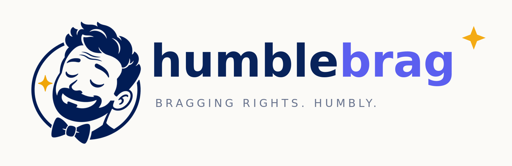

<p align="center">
  
</p>

<p align="center">
  <strong>Professional and lifestyle self-importance, automated.</strong>
</p>

Synthetic social achievement theater: an embeddable Next.js + React generator backed by Vercel eve agents and AWS Bedrock.

The identity pairs a self-satisfied gentleman mascot with deep navy, electric periwinkle, and a restrained flash of gold: witty and relatable, confident but not cocky, and unapologetically dev-friendly.

## Brand assets

- `public/brand/humblebrag-mark-512.png` — transparent, web-optimized mascot mark
- `public/brand/readme-hero.png` — repository and social hero
- `public/favicon.ico`, `public/icon.png`, and `public/apple-touch-icon.png` — browser and device icons

## Networks

- **WorkIt** — fictional professional-network parody. Dedicated `workit_writer` eve subagent generates corporate career theater.
- **Influenzr** — fictional image-first lifestyle-network parody. Dedicated `influenzr_writer` eve subagent generates curated-authenticity lifestyle posts.

The two networks intentionally have separate agent instructions, persona vocabularies, captions, comments, metrics, image briefs, and React presentation skins.

## Generation pipeline

1. Root eve agent routes the premise to the network-specific subagent.
2. Specialist returns structured JSON for a fictional post and a four-person roster: one author plus three commenters.
3. Bedrock Stable Image Ultra creates the author's avatar.
4. Stable Image Ultra creates the post scene and all commenter avatars in parallel, using the author avatar as an image-to-image identity reference for the scene when possible.
5. React renders the final post in the selected parody network skin.
6. Drizzle stores the post and relational roster in Neon; Vercel Blob stores every generated image.
7. Every completed post receives a durable `/p/[id]` permalink.

The progress UI exposes humorous generated artifacts while the real pipeline advances through copy, avatar, scene, and finishing stages.

## Persistence

Generated copy and metadata are stored in Neon Postgres through Drizzle. Each post owns a relational roster whose comments reference stable person IDs. Author, commenter, and scene images are written to public Vercel Blob URLs instead of remaining as ephemeral base64 data. The homepage independently resolves a completed permalink-backed default for WorkIt and Influenzr, and each generation redirects to its shareable permalink after every image is safely stored.

Post and roster creation is transactional. Image requests must match the persisted visual briefs, completed posts are immutable through the generation API, and a post cannot be finalized until its scene and all four roster avatars have durable Blob URLs.

Schema changes live in `drizzle/`. Apply them with `npm run db:migrate` after providing `DATABASE_URL` in the process environment.

## Development

Node.js 24 or newer is required.

```bash
npm install
npm run dev
```

## Embed

```html
<script
  async
  src="https://humblebrag-hq.vercel.app/embed.js"
  data-network="workit"
  data-persona="startup-founder"
  data-prompt="A founder announcing a tiny podcast appearance as if it were a Nobel Prize">
</script>
```

The embed loader creates an iframe pointed at `/embed` and auto-generates the requested post.

## Safety / parody boundaries

All generated people, companies, brands, events, and comments are fictional. Image prompts explicitly exclude real celebrities/public figures, logos, and readable brand marks. The UI uses original parody names and marks rather than copying official trademarks.

## License

[MIT](./LICENSE)
